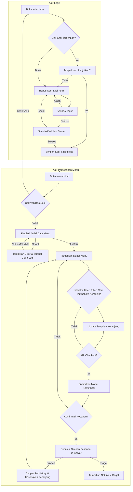

# Resto & Cafe - Sistem Pemesanan Waiter

Aplikasi web modern untuk waiter restoran yang memungkinkan mereka mengelola pesanan pelanggan secara efisien. Aplikasi ini dibangun dengan HTML, CSS, dan JavaScript modern (ES6 Modules) tanpa menggunakan framework eksternal.

## Fitur Utama

-   **Login Waiter:** Sistem otentikasi sederhana dengan validasi input dan manajemen sesi.
-   **Manajemen Menu:** Menampilkan daftar menu dengan fitur pencarian dan filter berdasarkan kategori.
-   **Keranjang Pesanan:** Menambah, mengubah kuantitas, dan menghapus item dari keranjang secara dinamis.
-   **Proses Checkout:** Konfirmasi pesanan melalui modal dengan rincian lengkap sebelum finalisasi.
-   **Riwayat Pesanan:** Melihat riwayat pesanan yang telah berhasil dibuat.
-   **Manajemen Sesi:** Sesi login disimpan dengan aman dan dapat dipulihkan.
-   **Tema Ganda:** Pilihan antara tema terang (light) dan gelap (dark) yang tersimpan di preferensi pengguna.
-   **Desain Responsif:** Tampilan yang beradaptasi dengan baik di berbagai ukuran layar.

## Struktur Proyek

Proyek ini diorganisir dengan struktur yang bersih dan modular untuk kemudahan pemeliharaan.

```
waiters/
├── assets/
│   ├── css/
│   └── img/
├── src/
│   ├── modules/
│   │   ├── api.js
│   │   ├── config.js
│   │   ├── notifikasi.js
│   │   ├── penyimpanan.js
│   │   ├── tema.js
│   │   └── validasi.js
│   ├── main.js         (Logika untuk halaman login)
│   └── menu.js         (Logika untuk halaman menu)
├── index.html          (Halaman Login)
├── menu.html           (Halaman Menu & Pemesanan)
└── README.md           (Dokumentasi ini)
```

---

## Arsitektur & Alur Kerja Sistem

Aplikasi ini terbagi menjadi dua alur utama: **Alur Login** dan **Alur Pemesanan Menu**.

### Flowchart Sistem

Berikut adalah flowchart yang menggambarkan alur kerja aplikasi secara keseluruhan.



### Penjelasan Modul Sistem (`/src/modules`)

Setiap modul memiliki tanggung jawab yang spesifik untuk menjaga kode tetap terorganisir.

#### 1. `api.js` (Modul API)
-   **Maksud:** Modul ini bertanggung jawab untuk semua komunikasi dengan server. Dalam proyek ini, ia **mensimulasikan** panggilan API.
-   **Cara Kerja:**
    -   `ambilDaftarMenu()`: Mensimulasikan pengambilan data menu dengan jeda waktu dan kemungkinan gagal 10% untuk menguji ketahanan aplikasi.
    -   `simpanPesanan()`: Mensimulasikan pengiriman data pesanan ke server dan mengembalikan ID pesanan jika berhasil.
    -   `simulasiValidasiServer()`: Mensimulasikan validasi data login di sisi server.
    -   **Metode GET & POST yang Disimulasikan:**
        -   **`GET`**: Diwakili oleh `ambilDaftarMenu()`. Metode ini digunakan untuk *mengambil* data dari server. Dalam kasus ini, aplikasi meminta daftar menu tanpa mengubah data apa pun di server.
        -   **`POST`**: Diwakili oleh `simpanPesanan()` dan `simulasiValidasiServer()`. Metode ini digunakan untuk *mengirim* atau *menyimpan* data baru ke server.
            -   Saat login, aplikasi mengirimkan data waiter untuk divalidasi.
            -   Saat checkout, aplikasi mengirimkan data keranjang untuk dibuat menjadi pesanan baru.

#### 2. `penyimpanan.js` (Modul Penyimpanan)
-   **Maksud:** Ini adalah "otak" dari manajemen data di sisi klien. Modul ini mengelola semua data yang disimpan di `sessionStorage` dan `localStorage`.
-   **Cara Kerja:**
    -   Menyimpan data sesi waiter (`dataWaiter_v2`) yang dienkripsi ke `sessionStorage` dan `localStorage` (sebagai backup).
    -   Menyimpan data keranjang (`keranjangPesanan_v2`) dan riwayat pesanan (`historyPesanan_v2`) ke `localStorage` agar tidak hilang saat browser ditutup.
    -   Menyediakan fungsi untuk mengambil, menyimpan, dan menghapus data dengan aman.
    -   Menggunakan enkripsi sederhana (`btoa` dan Caesar cipher) untuk menyamarkan data sesi.

#### 3. `validasi.js` (Modul Validasi)
-   **Maksud:** Memastikan semua data yang diinput oleh pengguna pada form login sesuai dengan aturan yang ditetapkan.
-   **Cara Kerja:**
    -   Berisi aturan-aturan validasi seperti panjang minimal/maksimal dan pola karakter.
    -   Menyediakan fungsi terpisah untuk memvalidasi setiap input (nama, shift, kode waiter).
    -   `validasiFormLengkap()` menggabungkan semua hasil validasi untuk memberikan keputusan akhir apakah form valid atau tidak.

#### 4. `notifikasi.js` (Modul Notifikasi)
-   **Maksud:** Memberikan umpan balik visual kepada pengguna dalam bentuk notifikasi *toast* (di halaman menu) atau notifikasi di bawah form (di halaman login).
-   **Cara Kerja:**
    -   Secara dinamis membuat elemen HTML untuk notifikasi.
    -   Menampilkannya di layar dengan tipe yang berbeda (sukses, error, info).
    -   Menghapus notifikasi secara otomatis setelah beberapa detik.

#### 5. `tema.js` (Modul Tema)
-   **Maksud:** Mengelola pergantian antara tema terang (light) dan gelap (dark).
-   **Cara Kerja:**
    -   Mengubah `class` pada elemen `<body>` untuk menerapkan file CSS yang sesuai.
    -   Menyimpan pilihan tema pengguna di `localStorage` sehingga preferensi tetap terjaga saat halaman dibuka kembali.

#### 6. `config.js` (Modul Konfigurasi)
-   **Maksud:** Menyimpan data statis atau konfigurasi aplikasi.
-   **Cara Kerja:** Saat ini, file ini hanya berisi array `dataMenuRestoran`, yang bertindak sebagai database menu sementara.

---

## Cara Menjalankan Aplikasi

1.  Pastikan semua file berada dalam struktur folder yang benar.
2.  Buka file `index.html` menggunakan browser web modern seperti Google Chrome, Firefox, atau Edge.
3.  Aplikasi siap digunakan.

---

## Teknologi & Fitur JavaScript yang Digunakan

Bagian ini merinci fitur-fitur JavaScript modern yang menjadi tulang punggung aplikasi ini dan di mana Anda dapat menemukannya.

*   **Modular JavaScript (`import`/`export`)**
    *   **Lokasi:** Seluruh direktori `src/`.
    *   **Penjelasan:** Aplikasi ini dibangun secara modular. Setiap file di `src/modules/` mengekspor (`export`) fungsionalitas spesifik (misalnya, `modulTema`), yang kemudian diimpor (`import`) oleh file utama seperti `main.js` dan `menu.js`. Ini membuat kode lebih terorganisir dan mudah dikelola.
    *   **Contoh (`src/main.js`):**
        ```javascript
        import { modulTema } from './modules/tema.js';
        import { modulPenyimpanan } from './modules/penyimpanan.js';
        ```

*   **Async/Await + `try...catch`**
    *   **Lokasi:** `src/modules/api.js`, `src/menu.js` (fungsi `muatMenu`, `prosesCheckout`), `src/main.js` (fungsi `prosesLogin`).
    *   **Penjelasan:** Digunakan untuk menangani operasi asinkron (seperti simulasi panggilan API) dengan cara yang terlihat sinkron dan mudah dibaca. Blok `try...catch` digunakan untuk menangani potensi error, seperti kegagalan koneksi API.
    *   **Contoh (`src/menu.js`):**
        ```javascript
        muatMenu: async function() {
            try {
                const hasil = await modulAPIRestoran.ambilDaftarMenu();
                // ... proses jika berhasil
            } catch (error) {
                // ... proses jika gagal
            }
        },
        ```

*   **Promises & Callback Function**
    *   **Lokasi:** `src/modules/api.js` (fungsi `simulasiValidasiServer`), dan hampir semua `addEventListener`.
    *   **Penjelasan:** `Promise` digunakan untuk mengelola hasil dari operasi asinkron yang mungkin berhasil atau gagal di masa depan. *Callback function* (fungsi yang dijalankan setelah tugas lain selesai) digunakan secara ekstensif dalam `addEventListener` untuk menangani interaksi pengguna.

*   **JSON (`JSON.parse()` & `JSON.stringify()`)**
    *   **Lokasi:** `src/modules/penyimpanan.js`.
    *   **Penjelasan:** `JSON.stringify()` digunakan untuk mengubah objek JavaScript (seperti data keranjang atau riwayat) menjadi format string sebelum disimpan di `localStorage`. `JSON.parse()` digunakan untuk mengubahnya kembali menjadi objek saat data diambil.

*   **Array & Object (Destructuring, Spread Operator)**
    *   **Lokasi:** `src/modules/penyimpanan.js` (fungsi `simpanDataWaiter`), `src/menu.js` (fungsi `filterDanRenderMenu`).
    *   **Penjelasan:** *Spread Operator* (`...`) digunakan untuk menyalin properti dari satu objek ke objek lain atau untuk membuat salinan array, memastikan data asli (state) tidak termutasi secara langsung.

*   **Array Methods (`map`, `filter`, `reduce`, `forEach`)**
    *   **`map()`**: Digunakan untuk mengubah setiap elemen dalam array menjadi sesuatu yang baru. Contohnya di `src/menu.js` dalam fungsi `tampilkanModalCheckout` untuk membuat daftar HTML dari setiap item di keranjang.
    *   **`filter()`**: Digunakan untuk menyaring array berdasarkan kondisi. Contohnya di `src/menu.js` dalam fungsi `filterDanRenderMenu` untuk menampilkan menu sesuai kategori atau pencarian.
    *   **`reduce()`**: Digunakan untuk menghitung satu nilai tunggal dari sebuah array. Contohnya di `src/menu.js` dalam fungsi `renderKeranjang` untuk menghitung total harga.
    *   **`forEach()`**: Digunakan untuk melakukan iterasi pada setiap elemen array. Contohnya di `src/menu.js` dalam fungsi `renderMenu` untuk membuat kartu untuk setiap item menu.

*   **`localStorage` & `sessionStorage`**
    *   **Lokasi:** `src/modules/penyimpanan.js`.
    *   **Penjelasan:**
        -   **`localStorage`**: Digunakan untuk menyimpan data yang harus tetap ada bahkan setelah browser ditutup, seperti `keranjangPesanan`, `historyPesanan`, `temaPilihan`, dan `backupWaiter`.
        -   **`sessionStorage`**: Digunakan untuk menyimpan data sesi login yang aktif (`dataWaiter_v2`). Data ini akan otomatis terhapus saat browser atau tab ditutup, sehingga lebih aman untuk data sesi.

*   **Web Fetch API (Simulasi `GET`/`POST`)**
    *   **Lokasi:** `src/modules/api.js`.
    *   **Penjelasan:** Meskipun tidak menggunakan `fetch()` sungguhan, modul ini mensimulasikan metode `GET` dan `POST`.
        -   **`GET`**: Diwakili oleh `ambilDaftarMenu()`, yang "mengambil" data menu.
        -   **`POST`**: Diwakili oleh `simpanPesanan()` dan `simulasiValidasiServer()`, yang "mengirim" data baru ke server untuk disimpan atau divalidasi.


link untuk tugas: 

*   **`link web:`**     https://resto-cafe-waiter.vercel.app/

*   **`link canva:`**    https://www.canva.com/design/DAG0N0hbxuo/FYDvmGcMuVwn5IA_mhw0_g/edit?utm_content=DAG0N0hbxuo&utm_campaign=designshare&utm_medium=link2&utm_source=sharebutton

*  **`link presentasi:`** https://youtu.be/NVbdHF_fFD4
---


--- 